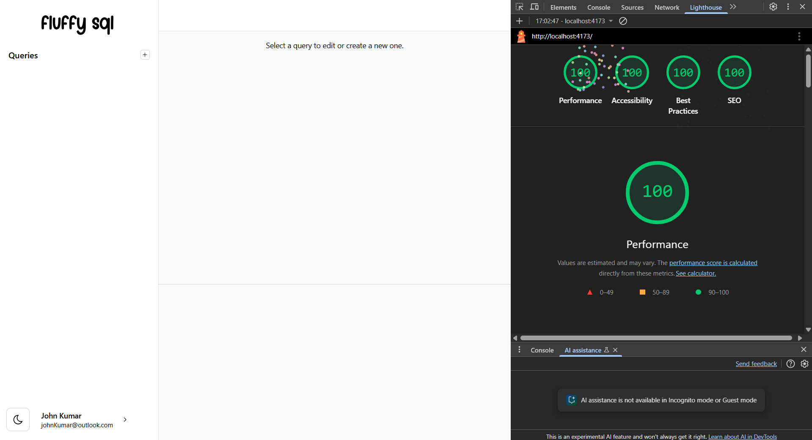
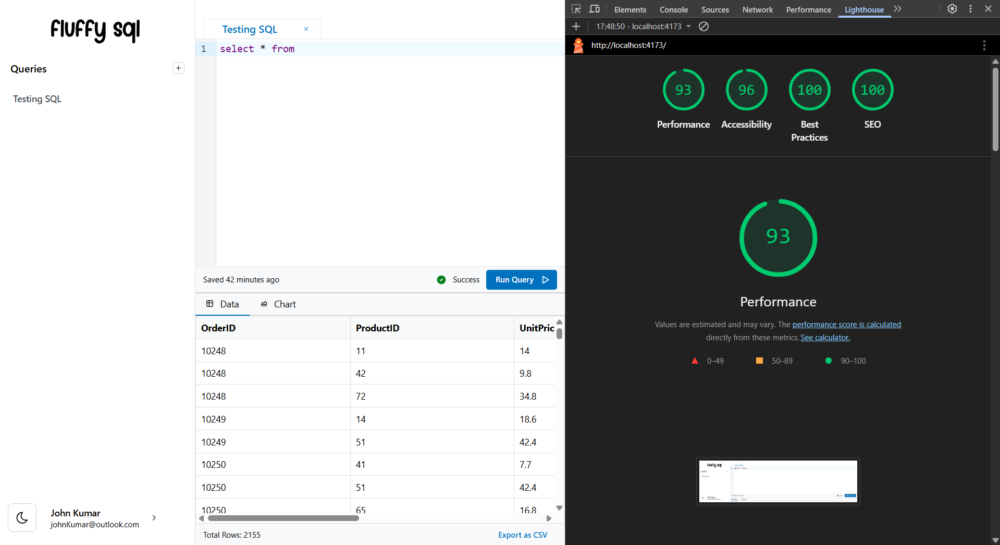

# Fluffy SQL, A SQL Query Runner UI

## App Features

- Full Featured multi-modal editor with syntax highlighting and other industry standard features
- Auto save of Queries
- Support large rows of data with minimal lag
- Export Output to CSV
- Persist storage with rehydration
- Resizable Code and Output windows
- Dark mode/light mode support

## App Stack

- Framework : [React](https://react.dev/) with [Typescript](https://www.typescriptlang.org/)
- Bundler: [Vite](https://vitejs.dev/)
- UI Framework : [Mantine](https://mantine.dev/)
- State Management: [Zustand](https://github.com/pmndrs/zustand)
- Editor: [Code Mirror](https://uiwjs.github.io/react-codemirror/)
- Data Table : [react-data-grid](https://adazzle.github.io/react-data-grid/)
- CSV Export : [Papaparse](https://www.papaparse.com/)

## Performance

### Empty State

## Performance Optimizations done

- Replaced Monaco with codemirror for better performance score. Although I feel Monaco is a much more mature editor.
- Used React-data-grid for rendering large data sets with virtualization
- Switched from gzip to brotli for better compression
- Removed and optimized unused dependencies

## What more features can be added ?

- Charts and export for charts
- Partial Sql Execution

## Why no tests

- Decided to invest the time in features as tests are super easy to generate using LLMs

## npm scripts

## Build and dev scripts

- `dev` – start development server
- `build` – build production version of the app
- `preview` – locally preview production build

### Testing scripts

- `typecheck` – checks TypeScript types
- `lint` – runs ESLint
- `prettier:check` – checks files with Prettier
- `vitest` – runs vitest tests
- `vitest:watch` – starts vitest watch
- `test` – runs `vitest`, `prettier:check`, `lint` and `typecheck` scripts

### Other scripts

- `storybook` – starts storybook dev server
- `storybook:build` – build production storybook bundle to `storybook-static`
- `prettier:write` – formats all files with Prettier
